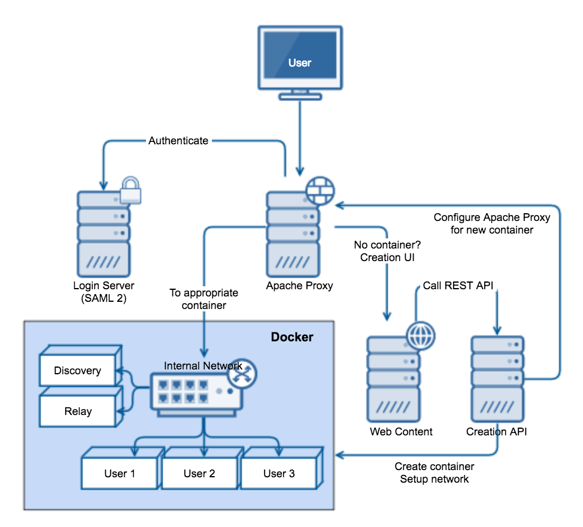

ikogan/syncthing
===================

[Syncthing](http://syncthing.net/) Docker image that includes relaying, discovery, and a basic
infrastructure to provide self-service (and managed) container creation for users.

> If you're coming from Docker Hub, look down below for information about the
> containers.

> Note: While `syncthing-inotify` is built and included in the image, it is not
> used by the scripts at the moment due to various issues encountered.

## Contents
<!-- vscode-markdown-toc -->
* 1. [Why?](#Why)
* 2. [What](#What)
* 3. [Architecture](#Architecture)
* 4. [Compatibility](#Compatibility)
* 5. [Installation/Configuration](#InstallationConfiguration)
    * 5.1. [Docker](#Docker)
        * 5.1.1. [Syncthing Versions](#SyncthingVersions)
    * 5.2. [`firewalld`](#firewalld)
    * 5.3. [`systemd`](#systemd)
    * 5.4. [`httpd`](#httpd)
    * 5.5. [Web UI](#WebUI)
* 6. [Attribution](#Attribution)

<!-- vscode-markdown-toc-config
    numbering=true
    autoSave=true
    /vscode-markdown-toc-config -->
<!-- /vscode-markdown-toc -->

##  1. <a name='Why'></a>Why?

Syncthing is a pretty awesome tool for synchronizing content across devices but it's primarily
designed for devices owned by a single user. Each syncthing instance runs on several ports
that are fairly standardized and the administration tool is a web UI, also running on a
standard port. While these ports can be changed, managing the list of ports on a given machine
is cumbersome at best. Additionally, Syncthing provides only basic authentication support, none
of which can be managed centrally.

##  2. <a name='What'></a>What

This repository includes several components that make managing Syncthing
in a centralized environment possible/easier:

1. Dockerfile that can create Syncthing containers for relay servers,
    discovery servers, and the Syncthing client itself.
2. Scripts to create discovery and relay containers in a standard way.
3. Script to create Syncthing client containers in several ways, from
    the command line, as a WSGI application, and as a REST API.
4. `systemd`, `firewalld`, and `httpd` configuration samples
    to set this all up.
5. A simple web UI users will invoke to create containers for
    themselves.

Note that this can all be used individually without the complete
infrastructure. Also, this is pretty rough and probably shouldn't be
used in production without a lot of analysis. It's mostly just a pile
of pieces connected together with duct tape.

##  3. <a name='Architecture'></a>Architecture

This architecture relies heavily on the way Apache's configuration
works, specifically, that `ProxyPass` entries are evaluated in order.



In the above, the user will attempt to go to a core syncthing URL,
say `https://my.domain.com/syncthing`. `httpd` will recognize that 
authentication for anything in `/syncthing` is required and use
`mod_auth_mellon` to authenticate with a SAML 2.0 IdP. Once authentication
completes, a `RewriteRule` will redirect the browser to a URL containing
the user's username; `https://my.domain.com/syncthing/username` for
example. If the user already has a container created, they will also
have an Apache configuration file in `/etc/httpd/conf.d/syncthing.d`
that will have a `ProxyPass` entry directing their browser to the container
exposed on the appropriate port.

If the user does not have a container, they will have no Apache
configuration and therefore no `ProxyPass` entry. In this case, the
rest of the configuration will cause their request to be handled
by the local webserver, loading a simple AngularjS web application.
This application will immediately make a `POST` request to an API
that is responsible for creating the container, setting up httpd,
and reloading it's configuration. Once the REST API completes, the
web UI will wait for `httpd` to restart and for Syncthing to become
available, reloading the page when it is. Upon reload, the `ProxyPass`
configuration will now exist, and Syncthing will load.

> Note: Some additional work needs to be done to ensure that users cannot
> access each other's Syncthing containers by altering the per-user
> config files to include additional `Require user` directives.

##  4. <a name='Compatibility'></a>Compatibility

This whole thing was built on Fedora 23 but should be compatible
with virtually any `systemd` based distribution (or others, if you
want to write your own configs). It should be possible to implement
in nginx instead but Apache was already on the system.

The REST API (and because I'm lazy, the entire Python script) requires
Flask and was built on the standard `python-flask` package on 
Fedora 23, Flask 0.10 (sorry).

The containers are just Docker containers, nothing fancy.

The web UI is an AngularJS/Patternfly application and was split from
a larger "portal". It's dependencies can be installed with the standard
incantation in the `www/portal` directory:

```bash
cd ./www/portal && npm install
```

The httpd configuration relies on
[mod_auth_mellon](https://github.com/UNINETT/mod_auth_mellon) for
SAML 2.0 authentication. A SAML 2.0 IdP is not provided, you'll need
to adapt the httpd configuration to suit your installation.

##  5. <a name='InstallationConfiguration'></a>Installation/Configuration

There are no general instructions as this is more a collection of
pieces rather than a complete solution. However, relevant information
about the individual pieces is provided.

###  5.1. <a name='Docker'></a>Docker

One Docker image is able to handle all 3 functions, relaying, discovery,
and the Syncthing client. The `start.sh` script handles what to start
and how. The following environment variables affect `start.sh`:

`ROLE`: The role of this container, one of `relay`, `discovery`, or `sync`.
Each of these is in turn effected by different environment variables.

`ST_SSL_ENABLED`: Defaults to enabled, if `false` or `no`, then the `-http`
argument is passed to Syncthing. If default, then a cert & key are expected
to exist in `/etc/syncthing/discovery/cert.pem` and
`/etc/syncthing/discovery/key.pem` in the container. Only used for the
`discovery` role.

`DISCOVERY_SERVER`: Address of the discovery server for the Syncthing
client. Only used with the `sync` role. Defaults to unset.

`RELAY_SERVER`: Address of the relay server for the Syncthing client.
Only used with the `SYNC` role. Defaults to unset.

`DISABLE_UPNP`: Disable the use of UPnP when you want to force the use
of your local discovery server (for security/privacy reasons). Only used
for the `sync` role. Defaults to unset, which means UPnP is enabled.

`DISABLE_RELAY`: Disabl the use of relaying entirely. This means Syncthing
will not attempt to use a public relay and is useful from a privacy
perspective. Only used with the `sync` role. Defaults to unset, which
means relaying is used.

When starting the syncthing client, the container expects for the first
argument to the container to be a user specification in the form of
`uid:gid`. The container will create a user in the container with those
IDs allowing to match a user in the host system. This is necessary as
user namespaces are not necessarily perfectly supported on all systems.

The relay server needs a location to store data and provides a volume
at `/etc/syncthing/relay` that can be mounted for that purpose.

The discovery server needs SSL certificates and provides volumes at
`/etc/syncthing/discovery/cert.pem` and `/etc/syncthing/discovery/key.pem`
where they can be mounted.

The Syncthing client requires a home directory where all shared data
is located and provides a volume at `/home/syncthing` where that data
can be mounted.

See the `create_container` method in `create-syncthing-container.py`
for details on creating a custom network for all of these containers
to interact and to allow each user to be assigned a specific IP address.

####  5.1.1. <a name='SyncthingVersions'></a>Syncthing Versions

When building this container, the following arguments can be used to
force a particular version (the latest is otherwise used):

- `SYNCTHING_VERSION`
- `SYNCTHIGN_INOTIFY_VERSION`

###  5.2. <a name='firewalld'></a>`firewalld`

If your system has `firewalld`, it may need to be configured to allow
this traffic. Service definitions are available in the `firewalld`
directory.

###  5.3. <a name='systemd'></a>`systemd`

In order to start the container creation API, `systemd` is leveraged
for it's ability to not only start the server, but monitor and ensure
that it's always running.

###  5.4. <a name='httpd'></a>`httpd`

The `httpd` directory contains the configuration used to implement the
architecture. It'll likely need changed for your particular environment.
The various decisions are documented within the configuration. Improvements
and further sample configurations would be great.

###  5.5. <a name='WebUI'></a>Web UI

The web UI has 4 main purposes:

- Call the creation API
- Display a spinner while creation proceeds
- Wait for creation to finish and reload the page
- Display any errors in useful ways

Using AngularJS and PatternFly is probably overkill for this but it
fit with the rest of the system's aesthetic and was easy to implement.

##  6. <a name='Attribution'></a>Attribution

This project depends on a lot of awesome technologies without which
it would be completely impossible:

- [Syncthing](https://syncthing.net/) (obviously).
- [Docker](https://www.docker.com/) (also obviously).
- [Apache httpd](https://httpd.apache.org/) (Proxying, WWW Server, rewrites)
- [mod_auth_mellon](https://github.com/UNINETT/mod_auth_mellon) (SAML 2.0 SSO)
- [Python](https://www.python.org/) & [Flask](http://flask.pocoo.org/) (Container creation API)
- [Docker SDK for Python](https://github.com/docker/docker-py) (Container creation API)
- [Gliphy](https://www.gliffy.com/) Diagraming
- [AngularJS](https://angularjs.org/) Overkill for the Web UI
- [PatternFly](https://www.patternfly.org/) Because why not?
- [systemd](https://www.freedesktop.org/wiki/Software/systemd/) For it's built-in process manager

I've probably missed something, sorry about that, just let me know and I'll include it.